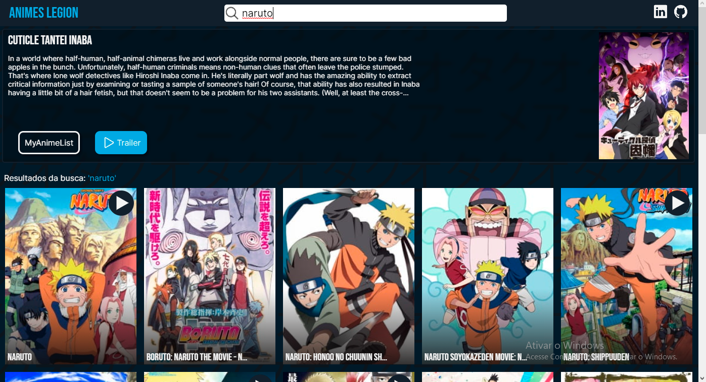

# Animes legion

Um site de busca de animes criado utilizando a jikan API (https://docs.api.jikan.moe). 
Link do projeto ao vivo: https://animeslegion.netlify.app

## Tecnologias
- Typescript
- ReactJS
- Styled components

## O que ele faz?
Ele apresenta algumas funcionalidades como um sistema de recomendação automático, esse sistema sempre irá recomendar um anime diferente ao recarregar a página. Além disso ele tem um sistema de busca, ao digitar o nome de um anime na barra de busca na parte superior do site e apertar a tecla Enter, vão aparecer todos os animes e filmes de anime que tenha alguma relação com o termo pesquisado. 
É possível acessar a pagina do anime no "My Anime List" clicando sobre o card do anime, e em alguns casos também é possivel acessar o trailer do anime clicando no botão "▶" no canto superior direito do card.

Se você quiser saber mais sobre mim e sobre meus projetos e so acessar o meu linkedIn e GitHub no canto superior direito do site ou clicando nos links abaixo. 
GitHub: https://github.com/mayron1806  
LinkedIn: https://www.linkedin.com/in/mayron-fernandes/

## Como rodar o projeto:

Você pode clonar o projeto e rodá-lo localmente seguindo os passos abaixo:

- <code>git clone https://github.com/mayron1806/busca-anime </code> para clonar o projeto

- <code>yarn</code> para instalar as dependências do projeto

- <code>yarn start</code>

- Acessar http://localhost:3000 no navegador

